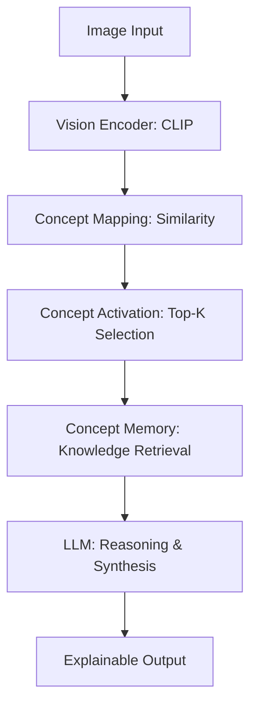

# Concept-Memory-LLM (CML)

**Concept-Memory-LLM** 是一個實驗性的多模態推理架構，旨在打破傳統 LMM 對高階硬體的依賴，實現低資源環境下的高效視覺推理。

不同於主流模型將圖片轉化為數百個視覺 Token，本專案將視覺輸入轉化為 **「稀疏語義概念集（Sparse Semantic Concepts）」**。這些概念會進一步觸發 **「概念記憶層（Concept Memory Layer）」**，讓語言模型能以極低的運算代價進行邏輯推理。

---

## 💡 核心哲學 (Core Philosophy)

傳統多模態模型 (如 LLaVA)：
> `Image → Visual Tokens (Heavy) → Transformer → Output`

**Concept-Memory-LLM**：
> `Image → Concept Activation → Concept Memory → Reasoning (Light)`

透過將圖片表示為 **「概念狀態（Concept States）」** 而非 Token，系統避開了巨大的 Context Window 壓力，即便在消費級 GPU（如 RTX 3060）上也能流暢運行。

---

## ✨ 核心特性 (Key Features)

* **概念激發 (Concept Activation)**：利用預訓練視覺編碼器（如 CLIP）將圖像精確映射至語義空間。
* **稀疏推理 (Sparse Reasoning)**：僅激活與當前場景最相關的概念，極大化推論效率。
* **概念記憶庫 (Concept Memory)**：被激發的概念會自動從結構化記憶庫中檢索關聯知識（如屬性、行為、常識）。
* **低顯存需求 (Low VRAM)**：專為 12GB 顯存以下的硬體設計，優化推論負載。
* **可解釋推理 (Explainable AI)**：概念激活過程透明可見，開發者可以直觀追蹤模型「看到了什麼」以及「聯想到了什麼」。

---

## 🏗️ 技術架構 (Architecture)

---

## 🎯 開發目標 (Project Goals)

本專案探索 **「概念級表徵（Concept-level Representation）」** 是否能成為 Token 化架構之外的另一種高效多模態路徑：

1.  **極致效率**：極小的上下文占用。
2.  **知識注入**：透過結構化記憶賦予模型更強的常識推理能力。
3.  **硬體民主化**：讓多模態推理不再是伺服器級 GPU 的專利。

---

## 🚀 專案狀態 (Status)

**Early Research Prototype.** 目前正致力於構建首個具備 1,000+ 核心語義概念的記憶矩陣。

---

### English Version (for International Developers)

# Concept-Memory-LLM (CML)

**Concept-Memory-LLM** is an experimental multimodal reasoning architecture designed to democratize AI by running on low-resource hardware.

Instead of expanding images into hundreds of compute-heavy visual tokens, CML transforms visual input into a **sparse set of semantic concepts**. These concepts act as keys to trigger a **Concept Memory Layer**, enabling the LLM to perform deep reasoning without the overhead of massive context windows.

### Why Concept-Memory-LLM?

* **From Tokens to States**: We represent images as semantic states, drastically reducing VRAM usage.
* **Knowledge-Augmented**: Retrieved concept memory provides the LLM with structured common sense and attributes.
* **Born for Mid-range GPUs**: Optimized specifically for hardware like the NVIDIA RTX 3060.
* **Built-in Interpretability**: Understand *why* the model reached a conclusion by inspecting activated concepts.

---

